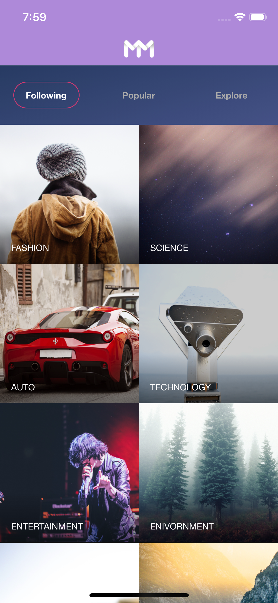
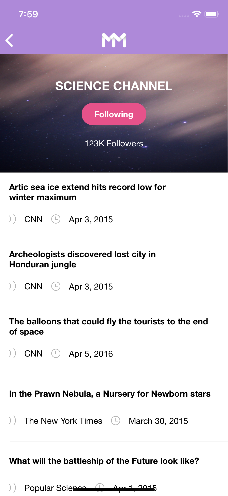
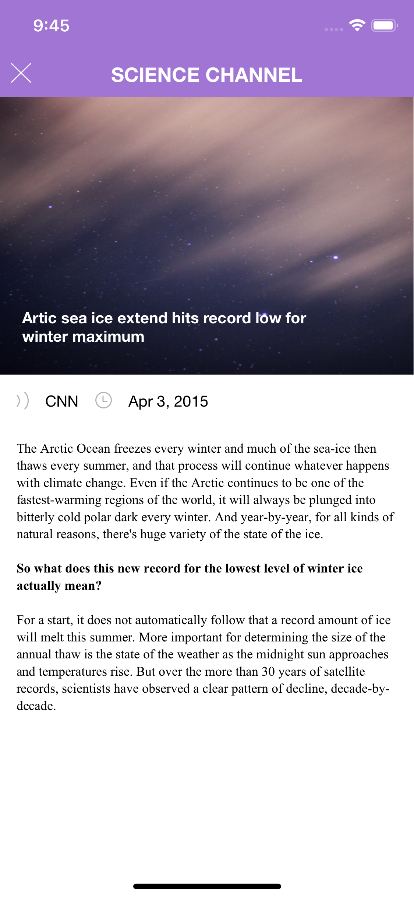

# MyMind

An iOS application to display different types of news articles and the corresponding news associated with it. 

# Home Screen

The app reads a json file from the bundle and lists three different categories of channels

* Following - Channels that you are following from either Popular or Explore category
* Popular - Channles from Popular category
* Explore - Channels from Explore category

Once the user selects one of the channels, the detailed screen is shown

# Detailed Screen

Detailed screen displays a list of news associated with it.

It also displays a "Follow"/"Following" button as part of its header which enables the user to follow/unfollow a channel.

Only the channels that you are following will be displayed when you select the "Following" category in Home Screen

Once the user selects one of the news, the news screen is shown

# News Screen

The news screen is a modal screen with the detailed news that the user selected.

It's displayed using a Text View by providing HTML text as attributed text.

